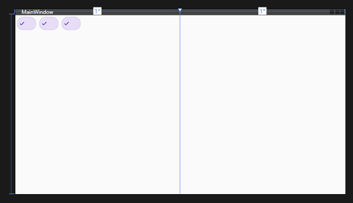
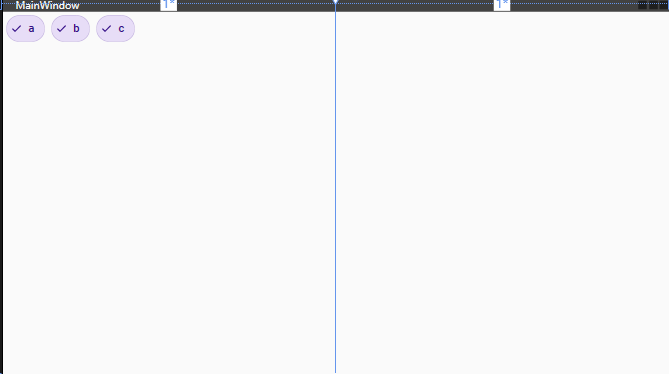
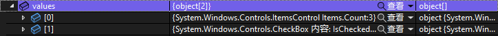
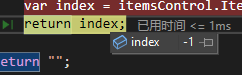
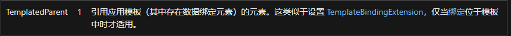
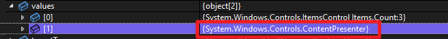
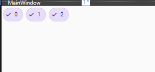
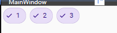

## 目的
该功能的目的是为了获取 Item 自身的 Index，并可以绑定到数据模板中。

## 创建项目
创建一个 WPF 应用程序项目，并添加下面的依赖
- [MaterialDesignThemes](https://github.com/MaterialDesignInXAML/MaterialDesignInXamlToolkit)
  > 注意按照 [Getting Start](https://github.com/MaterialDesignInXAML/MaterialDesignInXamlToolkit/wiki/Getting-Started) 来配置主题

## 添加 ItemsControl
将 `Grid` 分为两列，左列添加一个 `ItemsControl`，并将 `ItemsControl.ItemsPanel` 中 `ItemsPanelTemplate` 的内容设置为 `WarpPanel`，这样，子元素就能够自己排列了。同时将 `ItemsControl.ItemTemplate` 的模板设置为 `DataTemplate`。

现在的代码应该和下面一样，设计器中应该可以看见 `Grid` 已经被分成两列了。
```xml
<Grid>
    <Grid.ColumnDefinitions>
        <ColumnDefinition/>
        <ColumnDefinition/>
    </Grid.ColumnDefinitions>
    <ItemsControl>
        <ItemsControl.ItemsPanel>
            <ItemsPanelTemplate>
                <WrapPanel/>
            </ItemsPanelTemplate>
        </ItemsControl.ItemsPanel>
        <ItemsControl.ItemTemplate>
            <DataTemplate>
            </DataTemplate>
        </ItemsControl.ItemTemplate>
    </ItemsControl>
</Grid>
```

这个 `ItemsControl` 所需要做的功能，除了显示每个 Item 自身的 Index，我还希望能够选中并显示到第二列中。

在 [MaterialDesignThemes](https://github.com/MaterialDesignInXAML/MaterialDesignInXamlToolkit) 的 [DemoApp](https://github.com/MaterialDesignInXAML/MaterialDesignInXamlToolkit/releases/tag/v4.9.0) 中，目录中有一栏叫 Chips，用来做为子控件感觉还不错，复制 Filter Chips 中的代码，添加到 `DataTemplate` 中。

把复制过来的代码中的 Content 删除，并将 `TextBlock` 填入 Content 中，Text 的内容暂时保留。代码应该如下所示：
```xml
<ItemsControl>
    <ItemsControl.ItemsPanel>
        <ItemsPanelTemplate>
            <WrapPanel />
        </ItemsPanelTemplate>
    </ItemsControl.ItemsPanel>
    <ItemsControl.ItemTemplate>
        <DataTemplate>
            <CheckBox IsChecked="True"
                      Style="{StaticResource MaterialDesignFilterChipPrimaryOutlineCheckBox}">
                <TextBlock />
            </CheckBox>
        </DataTemplate>
    </ItemsControl.ItemTemplate>
</ItemsControl>
```

现在还没有东西显示出来，为了能够显示一点东西，先为 `ItemsControl` 添加一个硬编码的 ItemSource。

为了添加的内容较为简单，直接用数组即可，元素则使用字符串。为了使用基本类型，首先需要将 `System` 命名空间添加到 XAML 当中，此处将其引入名称指定为 `sys`。
```xml
<Window x:Class="IndexWithItemsControl.MainWindow"
        [...]
        xmlns:sys="clr-namespace:System;assembly=mscorlib"
        [...]>
    <Grid[...]>
</Window>
```

接下来为 `ItemsControl` 添加硬编码的 ItemSource。数组使用 `x:Array` 标记，字符串我们使用 `sys:String` 标记。

随便添加一点元素就行。我的代码如下，简单的添加了三个 `String`。
```xml
<ItemsControl>
    <ItemsControl.ItemsSource>
        <x:Array Type="{x:Type sys:String}">
            <sys:String>a</sys:String>
            <sys:String>b</sys:String>
            <sys:String>c</sys:String>
        </x:Array>
    </ItemsControl.ItemsSource>
    <ItemsControl.ItemsPanel[...]>
    <ItemsControl.ItemTemplate[...]>
</ItemsControl>
```

这时候已经能看到设计器上面有三个 Chips 按钮了。



## 添加 Converter 来获取 Index
为了获取 Index，我们需要找一下 `ItemsControl` 的[文档](https://learn.microsoft.com/zh-cn/dotnet/api/system.windows.controls.itemscontrol?view=windowsdesktop-8.0)，但是里面好像并没有想要的东西。

不过有一个属性比较令人在意，叫 [ItemContainerGenerator](https://learn.microsoft.com/zh-cn/dotnet/api/system.windows.controls.itemscontrol.itemcontainergenerator?view=windowsdesktop-8.0)。

点开这个属性的类型 [ItemContainerGenerator 类](https://learn.microsoft.com/zh-cn/dotnet/api/system.windows.controls.itemcontainergenerator?view=windowsdesktop-8.0)看看，发现里面有一个函数叫做 [IndexFromContainer](https://learn.microsoft.com/zh-cn/dotnet/api/system.windows.controls.itemcontainergenerator.indexfromcontainer?view=windowsdesktop-8.0#system-windows-controls-itemcontainergenerator-indexfromcontainer(system-windows-dependencyobject))。

稍微理一下，首先是 `ItemsControl` 中有一个 `ItemContainerGenerator`，每当 `ItemsControl` 的 ItemSource 更新时，应该会通过这个 Generator 来生成 UI。

那么现在通过 `IndexFromContainer` 这个函数，我们应该就可以拿到 Item 对应控件的 Index 了，这个 Index 同样也是 Item 的 Index。但是有一个问题是，这个传入的参数，即当前 Item 对应控件，该如何获取？

回到 Visual Studio 的项目。我们为 `TextBlock` 加一个绑定，但是特殊的是这个绑定只写一个语法，并不指定其他的东西，甚至是 `Path`。
```xml
<ItemsControl.ItemTemplate>
    <DataTemplate>
        <CheckBox IsChecked="True"
                  Style="{StaticResource MaterialDesignFilterChipPrimaryOutlineCheckBox}">
            <TextBlock Text="{Binding}"/>
        </CheckBox>
    </DataTemplate>
</ItemsControl.ItemTemplate>
```

看向设计器，一个令人兴奋的效果出现了，我们数组中的元素出现在了 Text 中。



有这么个想法产生了，如果我们获取 `DataTemplate` 或者 `CheckBox` 控件，但是不指定其 Path 来绑定，那么传入的不就是控件自身了吗？

为了调用 `IndexFromContainer` 函数，还需要获得 `ItemsControl` 的 `ItemContainerGenerator`。所以需要用到 `MultiBinding`，这个绑定和 `Binding` 的区别在于，它可以绑定多个数据。

那么事不宜迟，开始为 `TextBlock` 来进行 `MultiBinding`。其中的 `Binding`，分别绑定 `ItemsControl` 的 `ItemContainerGenerator` 和当前控件。
```xml
<TextBlock>
    <TextBlock.Text>
        <MultiBinding>
            <Binding RelativeSource="{RelativeSource Mode=FindAncestor,AncestorType=ItemsControl}"></Binding>
            <Binding RelativeSource="{RelativeSource Mode=FindAncestor,AncestorType=CheckBox}"></Binding>
        </MultiBinding>
    </TextBlock.Text>
</TextBlock>
```

不过绑定失败了，提示我们需要一个 MultiConverter，而且我们发现我们虽然拿到了控件，但是并不能运行需要的函数。

为了先使绑定成功，先新建一个 Converter，类的名字命名为 `IndexOfItemsControlConverter`。类的内容应如下所示。
```csharp
using System;
using System.Globalization;
using System.Windows.Data;

namespace IndexWithItemsControl.Converters
{
    public class IndexOfItemsControlConverter : IMultiValueConverter
    {
        public object Convert(object[] values, Type targetType, object parameter, CultureInfo culture)
        {
            throw new NotImplementedException();
        }

        public object[] ConvertBack(object value, Type[] targetTypes, object parameter, CultureInfo culture)
        {
            throw new NotImplementedException();
        }
    }
}
```

为 Converter 实现了 `IMultiValueConverter` 接口，这样就可以让 `MultiBinding` 使用此 Converter。

> Converter 的使用可以查看 [如何：转换绑定的数据](https://learn.microsoft.com/zh-cn/dotnet/desktop/wpf/data/how-to-convert-bound-data?view=netframeworkdesktop-4.8)

我们可以将返回值直接返回 `values`，并在 `Convert` 函数的 return 处打上断点。
```csharp
public object Convert(object[] values, Type targetType, object parameter, CultureInfo culture)
{
    return values;
}

public object[] ConvertBack(object value, Type[] targetTypes, object parameter, CultureInfo culture)
{
    if (value is object[] list)
    {
        return list;
    }
    return new object[] { value };
}
```

然后将该 Converter 应用到刚才 `TextBlock.Text` 的绑定中。需要首先引入命名空间，然后将 Converter 添加到资源当中，并设置它的 Key。最后添加到绑定中。
```xml
<Window [...]
        xmlns:converter="clr-namespace:IndexWithItemsControl.Converters"
        [...]>
    <Window.Resources>
        <converter:IndexOfItemsControlConverter x:Key="IndexOfItemsControlConverter"/>
    </Window.Resources>
    <Grid>
        <Grid.ColumnDefinitions[...]>
        <ItemsControl>
            <ItemsControl.ItemsSource[...]>
            <ItemsControl.ItemsPanel[...]>
            <ItemsControl.ItemTemplate>
                <DataTemplate>
                    <CheckBox[...]>
                        <TextBlock>
                            <TextBlock.Text>
                                <MultiBinding Converter="{StaticResource IndexOfItemsControlConverter}">
                                    <Binding[...]>
                                    <Binding[...]>
                                </MultiBinding>
                            </TextBlock.Text>
                        </TextBlock>
                    </CheckBox>
                </DataTemplate>
            </ItemsControl.ItemTemplate>
        </ItemsControl>
    </Grid>
</Window>
```

现在调试运行一下，看绑定的控件是否都传入了。



如果和上图一样，都是这 `ItemsControl` 和 `CheckBox` 类型，那么说明绑定成功了。如果调试步骤没有进入 Convert，或者 `values` 的内容有区别，需要检查一下绑定是否是按照上面的来的。

> 你可能注意到了有几个绑定失败的提示，这是因为在 Convert 中返回的 `values` 在退出函数之后被销毁了，所以 `TextBlock.Text` 拿到了一个空值。
>
> 如果需要拿到非空值，需要使用 `values.Clone()`。

现在需要的内容都有了，开始获取 Index 吧！

在 Convert 函数中，先把 `ItemsControl` 和 `CheckBox` 选出来。
```csharp
public object Convert(object[] values, Type targetType, object parameter, CultureInfo culture)
{
    ItemsControl? itemsControl = null;
    CheckBox? checkBox = null;
    foreach (var val in values)
    {
        if (val is ItemsControl i)
        {
            itemsControl = i;
            continue;
        }
        if (val is CheckBox c)
        {
            checkBox = c;
            continue;
        }
    }
    return "";
}
```

然后，调用方法来获取 Index。
```csharp
public object Convert(object[] values, Type targetType, object parameter, CultureInfo culture)
{
    // ...
    if (itemsControl != null && checkBox != null)
    {
        var index = itemsControl.ItemContainerGenerator.IndexFromContainer(checkBox);
        return index;
    }
    return "";
}
```

生成一下项目，回到设计器，会发现 Text 还是没有内容。

在 `var index = ...` 处打上断点，然后调试执行。看向 `Index`，会发现其值为 -1。



这显然不符合我们的需求，`IndexFromContainer` 并没有找到我们需要的 Index，同时取消断点，会发现绑定又失败了，绑定的值又变为了 `null`。

看向官方文档 [RelativeSourceMode Enum](https://learn.microsoft.com/zh-cn/dotnet/api/system.windows.data.relativesourcemode?view=windowsdesktop-8.0#fields)，有一项叫做 `TemplatedParent`。翻译看看描述。



大概意思是能够获取到绑定的模板控件，那么将绑定的内容修改一下：
```xml
<MultiBinding[...]>
    <Binding[...]>
    <Binding RelativeSource="{RelativeSource Mode=TemplatedParent}"></Binding>
</MultiBinding>
```

同时在 Convert 方法中打一下断点，看看其内容。



发现它的类型是 `ContentPresenter`。修改 Convert 函数的内容。
```csharp
public object Convert(object[] values, Type targetType, object parameter, CultureInfo culture)
{
    ItemsControl? itemsControl = null;
    // modify
    ContentPresenter? content = null;
    foreach (var val in values)
    {
        if (val is ItemsControl i)
        {
            itemsControl = i;
            continue;
        }
        //         modify
        if (val is ContentPresenter c)
        {
            content = c;
            continue;
        }
    }
    //                          modify
    if (itemsControl != null && content != null)
    {
        //                                                                 modify
        var index = itemsControl.ItemContainerGenerator.IndexFromContainer(content);
        return $"{index}";
    }
    return "";
}
```

再次生成项目，回到设计器，应该可以看到 Text 的内容变成 Index 了。



当然可以返回时 `+1`，即 `return $"{index + 1}";` ，这样显示的起始 Index 就是 1 了。



## 附
仓库链接：[IndexWithItemsControl](https://github.com/studylessshape/WPFUserRecord/tree/main/IndexWithItemsControl)

文档列表：
- [MaterialDesignThemes - Getting Start](https://github.com/MaterialDesignInXAML/MaterialDesignInXamlToolkit/wiki/Getting-Started)
- [ItemsControl]((https://learn.microsoft.com/zh-cn/dotnet/api/system.windows.controls.itemscontrol?view=windowsdesktop-8.0))
- [ItemContainerGenerator 类](https://learn.microsoft.com/zh-cn/dotnet/api/system.windows.controls.itemcontainergenerator?view=windowsdesktop-8.0)
- [如何：转换绑定的数据](https://learn.microsoft.com/zh-cn/dotnet/desktop/wpf/data/how-to-convert-bound-data?view=netframeworkdesktop-4.8)
- [RelativeSourceMode Enum](https://learn.microsoft.com/zh-cn/dotnet/api/system.windows.data.relativesourcemode?view=windowsdesktop-8.0)