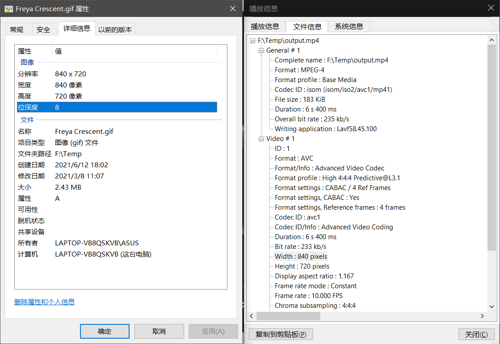
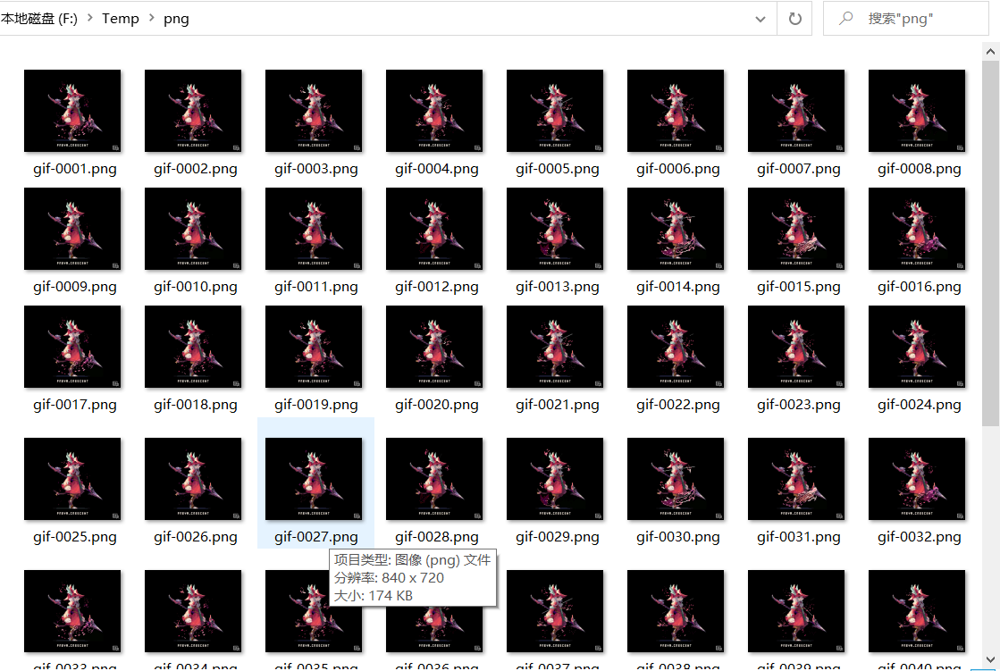

## GIF（或图片）转视频
这个相对简单，参数要求不多。用下面的图来测试（图片来源于 twitter ）。


使用命令
```sh
ffmpeg -i Freya%20Crescent.gif output.mp4
```

一般来说，不需要很多调整的时候， `ffmpeg -i` + 输入的文件地址 + 输出的文件地址 就可以完成很多想要的效果了，比如 `png` 与 `jpg` 等图片格式互转。`-i` 的 `i` 表示 `input`，即输入的意思，后面跟随一个文件地址，代表输入的文件。

来看看输出的视频与源图片的参数。宽高一致，每帧都为像素画，所以导出的码率相对比较能够让人满意。


实际上本人目前需要用到此功能不多，所以暂且只记录到浅层。

## 视频转GIF（图片）
这个如果直接使用上面说的命令，简单的导出gif，会发现**质量根本不行**。所以要导出高质量的gif，方法会比较多，有一些会稍微复杂一些。

这里以上面已经导出的视频 `output.mp4` 作为样本来使用。

### 方法一：将视频转换为图片，再将图片转为gif
这个方法的大概思路是将视频的每一帧都弄出来作为图片保存，然后把这些图片再转为gif。这种方法是我目前认为**导出质量最高的**。

首先创建一个**文件夹**，名字任意：
```sh
mkdir png
```

对于视频 `output.mp4` ，将其每一帧都保存为图片：
```sh
ffmpeg -i output.mp4 png/gif-%4d.png
```

**注意**上面的命令，在导出的图片文件名中，有一个像C语言格式化输出一样的字符串 `%4d` ，这个代表的是指定输出的数字位数，此处指定4位。**另外还要注意**，因为此处的视频只有短短的两秒，所以没有指定帧率，而是将所有的帧都导出了，而当视频比较长或者视频分辨率比较高的时候，使用 `-r` 适当减小帧率比较好。如下面将帧率限制为10帧。
```sh
ffmpeg -i output.mp4 -r 10 png/gif-%4d.png
```

还有一点，png 是较高质量的图片，占用空间比较大，如果没有太高的质量需求，可以导出为 jpg 等压缩格式图片。

在上面创建的文件夹下，可以看到导出的图片文件。


再使用下面的命令，即可将图片转为 gif ：
```sh
ffmpeg -i png/gif-%4d.png output.gif
```

### 方法二：先生成调色板，然后利用调色板生成gif
直接生成 gif 除了图片模糊，还有偏色的问题。生成调色板，然后再生成 gif 解决了这个问题。

使用下面的命令生成调色板：
```sh
ffmpeg -i output.mp4 -vf fps=30,scale=832:-1:flags=lanczos,palettegen palette.png
```

其中 `-vf` 表示 `video filter` ，即视频滤镜。这里设置帧率为30帧，分辨率为832:-1，表示宽为832，-1表示按比例设置。 lanczos 应该是压缩算法， palettegen 代表生成调色板，最后的 palette.png 表示生成的调色板的文件名。

生成好调色板之后，就可以利用调色板来生成gif了：
```sh
ffmpeg -i output.mp4 -i palette.png -filter_complex "fps=30,scale=832:-1:flags=lanczos[x];[x][1:v]paletteuse" out.gif
```

## 扩展
这些方法同时也能处理 gif 图，使用的命令差不多。