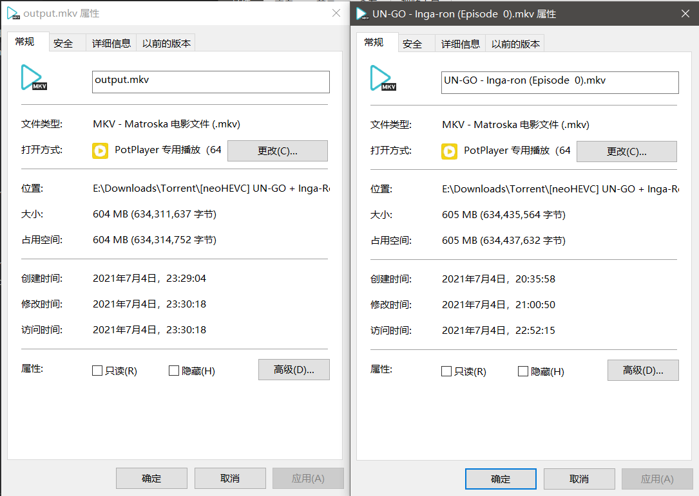
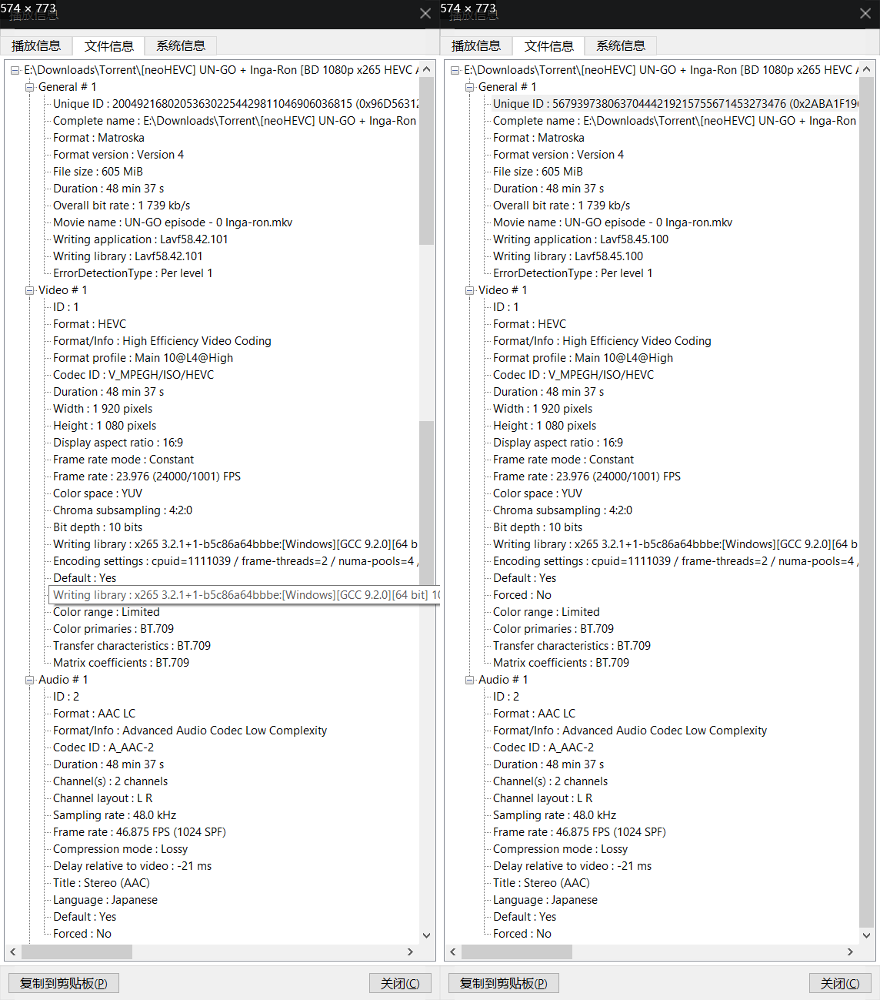

情景，我现在有一个有字幕的视频，但是我想对这个视频进行如下的操作：

## 1:字幕是外语，想把视频和字幕分开
这个比较简单，使用下面的命令可以提取视频（包含音频）:
```sh
ffmpeg -i video.mkv -vcodec copy -acodec copy -sn output.mkv
```

一般封装而不是压制的话，会用到 `mkv` 格式比较多，所以输入输出视频都是 `mkv` 格式。

解释一下参数的意义（自己理解+搜索到的）:
- `-vcodec` 表示视频解码， `copy` 表示复制，也就是直接复制视频流
- `-acodec` 表示音频解码， `copy` 表示复制，也就是直接复制音频流
- `sn`，即 `Subtitle` ， `n` 是不需要的意思，也就是不需要字幕

前面两条选项是为了保证输出视频中，视频和音频的质量；而第三个选项为什么需要呢？难道前面两条，不是已经限制了只复制视频流和音频流吗？具体我也不清楚，但是在我自己使用的时候，不加 `sn` 会导致字幕也一起复制到输出的视频中。

最后来看看效果:



可以看到几乎没有差别，但是导出的视频帧率也许没有原视频稳定。

来，举一反三，看看之后的其他问题

## 2:我只想要视频，其他的音频什么的都不要，作为视频剪辑的素材
通过上面的第一个问题，想必这个问题也很简单。

输入以下指令可以解决:
```sh
ffmpeg -i video.mkv -vcodec copy -an output.mp4
```

其中， `-an` 表示不需要音频，那么这样就能够单独输出视频流。这里输出时格式换成了 `mp4` ，因为源视频编码为 `H.265` 中的一种 (`HVC1`) ，所以导出文件选择 `mp4` 格式对质量影响应该不大。

## 3:我只需要音频，而视频中的音频轨可能不只一个
单个音轨的提取很简单，输入下面的指令:
```sh
ffmpeg -i video.mkv -acodec copy -vn output.mp3
```

其中， `-vn` 表示不需要视频流。但是输出音频会遇到很多问题，比如我遇到的：在 PotPlayer 中看到的解码格式为 `AAC` ，但是在导出为 `AAC` 格式的音频时，导出的文件有误。一是播放时长度未知，二是在和视频合并时，时间不正确（从原来的 `00:48:37` ，变成了 `28:02:57` ）。导出为 `mp3` 的话，这种问题也许就没了，但是会导致音频质量下降。所以如果只是单纯需要去掉字幕的话，第一个指令会很好，不会出现这种问题。

多音轨（ `TODO` ）

## 参考
1. [ffmpeg 提取 视频，音频，字幕 方法](https://blog.csdn.net/achang21/article/details/49128785)
2. [在ffmpeg中怎么合并音频和视频文件？](https://vimsky.com/article/3687.html)
3. [FFmpeg 提取视频的音频](https://www.cnblogs.com/CodeAndMoe/p/13360011.html)
4. [用ffmpeg转多音轨的mkv文件](https://blog.csdn.net/season_hangzhou/article/details/27503421)