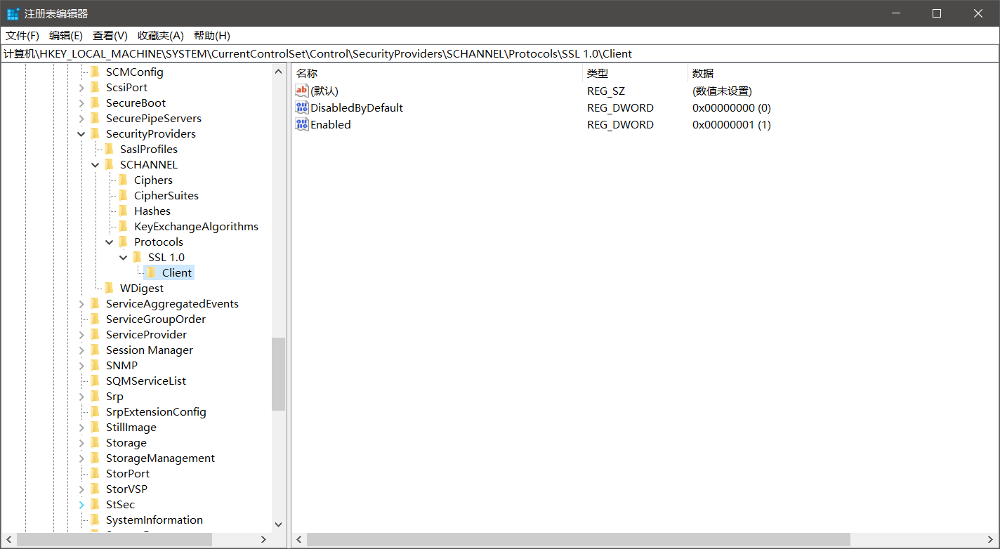

又是一件不起眼的小事，结果花了我几天的时间去解决。

前段时间，我的电脑突然就没法浏览网页了。网络问题在我的电脑上时常会发生，所以我很久之前就下了一个别人从数字家抽出来的一个断网工具。很快就检测出了问题并且可以正常浏览网页了。就在我兴致极好地进行网上冲浪的时候，突然有点想去某特，毕竟上次整了一阵去解锁帐号，感觉时不时还是要去登录一下，所以就去了。结果就出现了`ERR_SSL_PROTOCOL_ERROR`。

过了一阵要进github，校园网真的不行，有时进得去有时又进不去，然后又是`ERR_SSL_PROTOCOL_ERROR`。

之后又想进x歌进行搜索，但是出现了`400 bad request`。

百度/Bing了很多，但是大部分都是清楚Cookie和浏览数据，设置Internet选项……

找了两天突然在Microsoft Community的提问看到了，[Internet选项中的SSL2.0被取消了](https://answers.microsoft.com/zh-hans/ie/forum/all/win10%E7%B3%BB%E7%BB%9F%E7%9A%84ie%E8%AE%BE/a7f80150-565f-4232-b5a0-bbb7a600e90b)。

几经周转，没有查到什么好的方法，那就需要自己动手想办法，要么从命令行，要么从注册表启用。

命令行的没有找到，自己也很少使用，所以这条选项稍微摸索了一下就放弃了。

而注册表果然没有让我失望，竟然找到了[Microsoft关于SSL/TLS注册表修改的方法](https://docs.microsoft.com/zh-cn/windows-server/security/tls/tls-registry-settings)。按照步骤，我添加了一个SSL1.0的项，然后再次进入成功了。不清楚这是不是假象，但总归是暂时解决了。

或许过几天又会出问题，到时候再另说了。