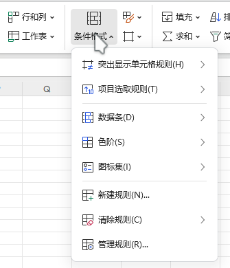
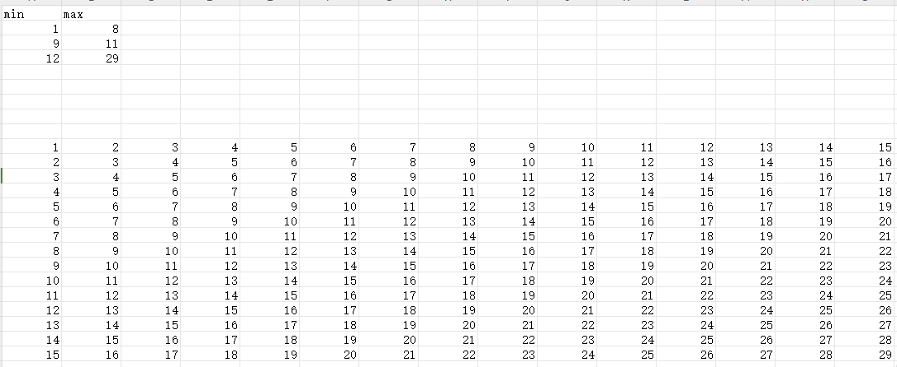
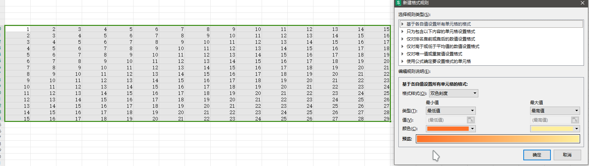
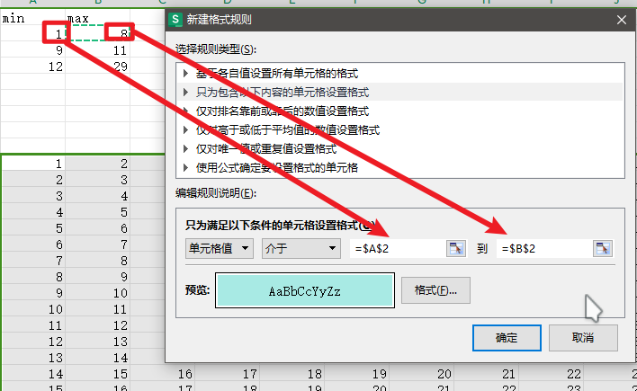
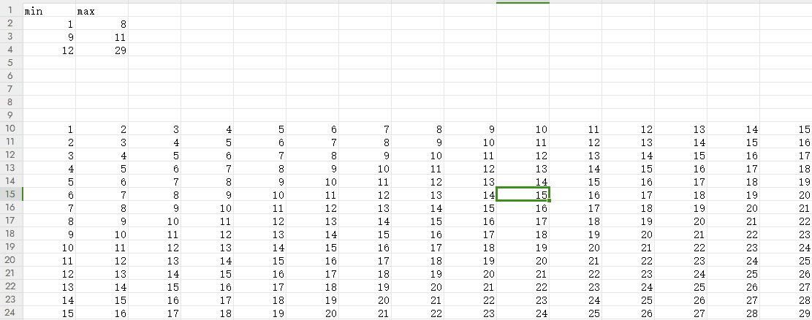
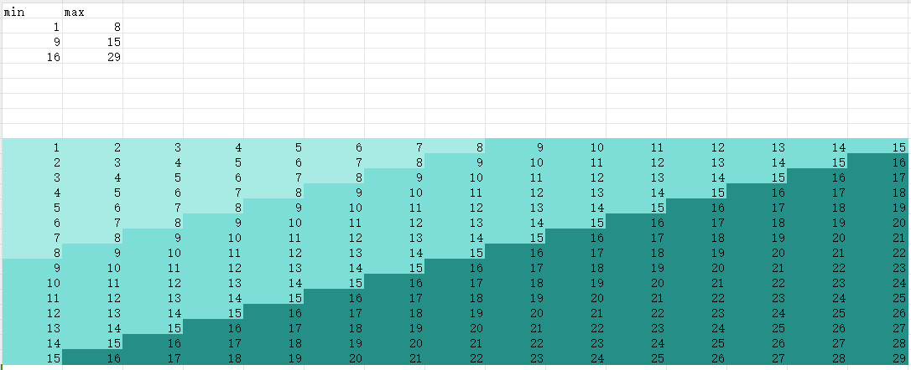
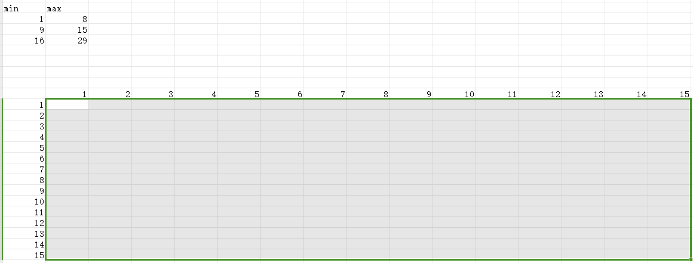
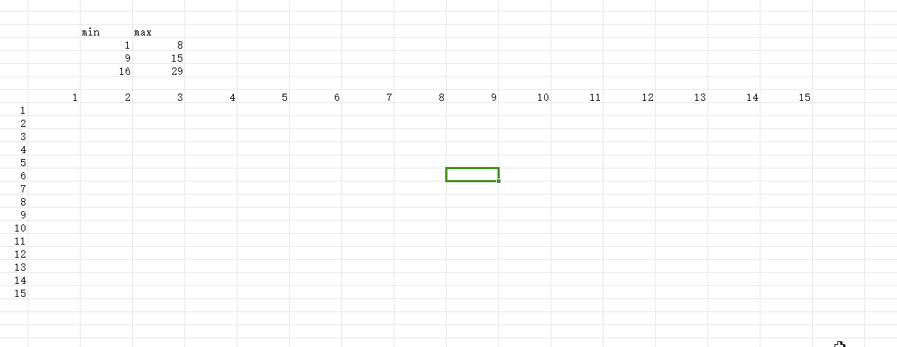
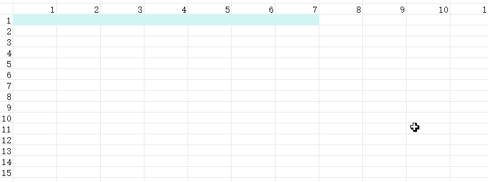
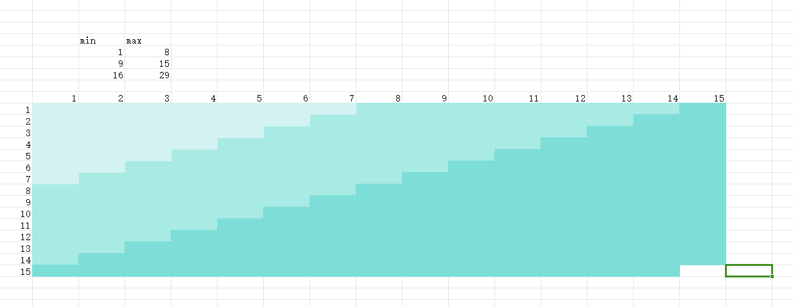

公式参考[公式中如何固定获取相对单元格的值](https://zhuanlan.zhihu.com/p/29887818)

## 问题
之前没怎么使用过 Excel，在遇到复杂的需求的时候就需要研究很久，所以这次记录下来。

情况是这样的，给一个最小值和最大值，介于两者之间的值的单元格，统一设置一个填充颜色。

## 使用条件格式
网上查找很容易就找到了条件格式。



假设现在有以下表格，要做的就是将下面的满足条件的值设置一个颜色。（图片使用的是 WPS，但 LibreOffice 和 Microsoft Office 的操作方式基本一致）



首先选中下面 1-29 所有的单元格，然后点击**条件格式** -> **新建规则**。应该会出现下图所示的弹窗。



然后选择第二项`只为包含以下内容的单元格设置格式`，第一个输入框可以输入最小值，也可以如下图一样选择一个单元格的值，第二个输入框同理，输入的是最大值。输入框下的格式就是配置满足条件后，单元格会被设置的格式。此处设置了单元格的颜色为淡青色。



点击确定后，应该可以看到满足条件的单元格变色了，并且如果改变选择的最大最小值，可以看到单元格颜色的变化。



利用同样的方式，可以设置更多的值的范围，最终可能得到的效果如下图。



## 另一种需求？
现在出现了另一种情况，并不是每个单元格都有一个值，如下图，但是我们需要根据有数值的那一行和有数值的那一列来设置中间没有数值的单元格格式。



这时候就要用到四个公式（参考[公式中如何固定获取相对单元格的值](https://zhuanlan.zhihu.com/p/29887818)）：
- `ROW()`：获取当前行号
- `COLUMN()`：获取当前列号
- `ADDRESS()`：根据行和列获取当前地址
- `INDIRECT()`：从给定的地址取值

有了这四个公式，就可以拿到想要的单元格的值了。

例如 `INDIRECT(ADDRESS(ROW()-1,COLUMN()-1))`，就是查找自身上一行和上一列的单元格值。

不过由于是根据自身单元格的行和列来查找的，所以需要一行一行或一列一列来设置。

选择一行空行，然后新建规则，选择`使用公式确定要设置的单元格`。将下面的公式复制到输入框中：

```excel
=AND(INDIRECT(ADDRESS(ROW()-1,COLUMN()))>=,INDIRECT(ADDRESS(ROW()-1,COLUMN()))<=)
```

通过鼠标点击，将光标调整到大于等于号后面，然后选择最小值的单元格，同理后面的小于等于号，选择最大值的单元格，设置好格式后点击确定即可。

整个过程可见下面的动图。



看起来效果还可以，但别忘了我们还有一列有数值的单元格。所以还需要一个 `INDIRECT` 获取对应的值，并将两者加起来。获取第一列的值的公式如下：
```excel
=INDIRECT(ADDRESS(ROW(),1));
```

如果不知道是第几列，`1` 的位置可以替换成 `COLUMN() - INDIRECT(ADDRESS(ROW()-1,COLUMN()))`，替换完的公式如下：

```excel
=INDIRECT(ADDRESS(ROW(),COLUMN() - INDIRECT(ADDRESS(ROW()-1,COLUMN()))));
```

将获取第一列的值和上一行的值结合起来，可以得到下面的公式：
```excel
=AND(INDIRECT(ADDRESS(ROW()-1,COLUMN()))+INDIRECT(ADDRESS(ROW(),COLUMN() - INDIRECT(ADDRESS(ROW()-1,COLUMN()))))>=,INDIRECT(ADDRESS(ROW()-1,COLUMN()))+INDIRECT(ADDRESS(ROW(),COLUMN() - INDIRECT(ADDRESS(ROW()-1,COLUMN()))))<=)
```

> 设置时，由于公式太长不太好将光标移动到想要的位置，可以用上面的 `INDIRECT(ADDRESS(ROW(),1))` 替换 `INDIRECT(ADDRESS(ROW(),COLUMN() - INDIRECT(ADDRESS(ROW()-1,COLUMN())))`。

看起来很长，实际上就是将行值和列值加起来了。按照上面的方法设置条件格式，应该可以获得下面的效果：



同时应该注意到，每个单元格可以设置多个条件格式，所以在对每一行进行重复设置后，应该可以得到下面的效果。



## 后记
Excel 在使用的时候，无不感觉商业软件在易用性上的成功。但一旦需要一些奇怪或是复杂的需求，光靠 Excel 自身就非常困难。上面可以看到，其实就五个简单的公式，但是完成复杂需求时就会组合嵌套导致公式巨长无比。而且条件格式的公式输入框的光标移动键，被强行改成了单元格选择，这就导致修改更加不便，也不知道为什么这么设计，明明旁边已经有了一个切换单元格选择的按钮。

当然这次后面的情况，实际上不太会出现，有的话应该就一行或一列，不太会出现列行同时的情况。

Excel 示例表格可以[点击此处获取](excel-condition-style.xlsx)。