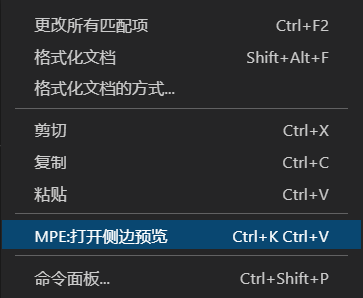

> 写这篇博客是防止之后遇到相同的事时，需要费很多时间解决。

有段时间没使用Vscode写Markdown了，最近要给别人发一个思路，然后觉得自己调word太费时了就想用Markdown偷下懒。结果就是点下面的选项没有作用

然后试了下`Shift+Ctrl+p`打开命令面板，然后使用预览。结果出现了报错，提示`Command not found`。在Bing和百度都搜寻不到合适的解决方案，不过最终在`github-issue`发现了一个相同的情况。在回答中找到了[解决方法](https://github.com/shd101wyy/vscode-markdown-preview-enhanced/issues/108#issuecomment-572964043)。

1. 卸载该插件
2. 提示需要重启，点击
3. 关闭Vscode
4. 删除用户目录下的`%USERS_NAME%/.vscode/extensions/.vscode/extensions/shd101wyy.markdown-preview-enhanced-0.5.1/`
5. 打开Vscode
6. 重新安装插件
7. 重启Vscode

注意`shd101wyy.markdown-preview-enhanced-0.5.1`这个文件夹，后面的数字是版本名，不清楚是否需要删除所有这个插件的文件夹，不过有这个前缀的我有两个，所以我都删了。

上面的方法要是还没用的话。就只能自己再找办法了。