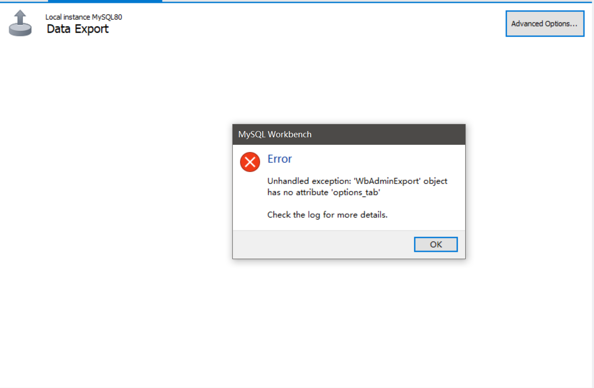

## 现象
在一个暖阳照射下的悠闲下午，打开了 MySQL Workbench，准备把现在的数据库手动导出一份做备份。熟练的点开 Server -> Data Export，结果出现的界面却是一片空白，点击 Advanced Options还会弹出报错。



提示去看下日志，结果只有下面这段看起来莫名奇妙的日志：

```log
17:36:30 [ERR][wb_admin_export.py:get_mysqldump_version:113]: Error retrieving version from C:\Program Files\MySQL\MySQL Server 8.0\bin\mysqldump.exe:
 (exit 0)Exception activating the page - '<' not supported between instances of 'NoneType' and 'str'Error retrieving version from C:\Program Files\MySQL\MySQL Server 8.0\bin\mysqldump.exe:
 (exit 0)Exception activating the page - '<' not supported between instances of 'NoneType' and 'str'Unhandled exception in Python code: 
Traceback (most recent call last):
  File "C:\Program Files\MySQL\MySQL Workbench 8.0\modules\wb_admin_export.py", line 2333, in show_options
    self.options_tab.show(True)
    ^^^^^^^^^^^^^^^^
AttributeError: 'WbAdminExport' object has no attribute 'options_tab'
```

然后去问了下 AI，只是告诉我，没有配置正确的 mysqldump.exe 的路径，或者是直接用 `mysqldump -u root -p 数据库名 > 备份文件.sql`。

## 解决
由于还是希望使用 UI 界面，所以还是尝试去解决了一下。原因后面会解释。

首先找到 `MySQL Workbench` 的软件目录，比如我这里是 `C:\Program Files\MySQL\MySQL Workbench 8.0`。

在目录下，有一个 `modules` 文件夹，进入这个文件夹。

在 `modules` 文件夹中，找到 `wb_admin_export.py` 这个文件，用你常用的编辑器打开它。

然后找到 109 行，可以看到下面这段代码：

```python
rc = local_run_cmd('"%s" --version' % path, output_handler=output.write)
```

把 `version` 改成 `help`，然后保存。修改完成的代码如下：

```python
rc = local_run_cmd('"%s" --help' % path, output_handler=output.write)
```

最后，如果启动了 Workbench，先关掉，然后再启动。

之后点开 Data Export 就没有问题了。

## 原因
排查问题原因，首先是上面的那段报错日志。根据报错日志我们可以定位到 `wb_admin_export.py` 的 113 行。

```python
    if rc or not output:
        log_error("Error retrieving version from %s:\n%s (exit %s)"%(path, output, rc))
        return None
```

但是这一行只是输出日志的，并不是问题出现的地方。

看到 `if` 条件，大致可以判断出，执行 `mysqldump.exe --version` 获取到的输出有问题。

先在命令行尝试一下这个命令，先判断下是不是没有配置环境变量，导致输出为空了。

```shell
PS C:\> mysqldump.exe --version
mysqldump  Ver 8.0.45 for Win64 on x86_64 (MySQL Community Server - GPL)
PS C:\>
```

像我这边是配置好了，所以有输出版本。

那就很奇怪了，明明 mysqldump 能运行，并且有输出，为什么会报错？

如果把这个丢给 AI，它大概率会回复，可能是没有配置环境变量，或者是 Workbench 没有配置 mysqldump 的路径。然后如果让它修复这段代码，它可能会怀疑 `mysqldump --version` 并没有输出到 stdout（即标准输出流），并且会尝试去获取 stderr（即标准错误流）。

但其实如果尝试过 `mysqldump --version > out.txt` 就会发现，`out.txt` 文件里的内容是空的。也就是说，输出到控制台上的内容，根本不是标准输出流里的。

后面我甚至尝试了使用 `Python` 和 `C#` 自己写代码，去获取其输出，结果无论是 stdout 还是 stderr 都是空的。

其实根本原因也无法明了，但是在这种情况下，我首先是采取了 AI 的思路，把 `return None` 改为返回一个默认的版本，代码变成了下面这样：

```python
    if rc or not output:
        log_error("Error retrieving version from %s:\n%s (exit %s)"%(path, output, rc))
        return Version(8, 0, 45)
```

但这样不太合适，如果版本一致还好，版本不一致可能会出问题。只能说在版本不变的情况下，可以稳定使用。

最好的方式肯定还是获取 mysqldump.exe 的版本。

这时候一种必定可行的思路，读取可执行文件中，文件信息附带的版本号。

这样就需要在 Workbench 中去配置 mysqldump 的绝对路径，而且对于 `wb_admin_export.py` 的改动很大。

也是巧合，我在思考如果这样，直接使用命令行其实也行，所以项先看看 mysqldump 有哪些命令可以用，所以使用 `--help` 去查看。

结果发现帮助的输出的第一行，居然有一模一样的版本输出。

然后试着把打印的内容输出到文件里，也成功了。所以试着去把 代码里的 `--version` 改成了 `--help`，试了下 Data Export，能正常使用了。

不过到最后，其实也没有弄明白 `mysqldump --version` 究竟是什么原理，可以正常输出控制台，但是输出无法输出到文件，其他程序去调用也没有办法去获取。

当然这个可能也和电脑环境有关系，比如公司电脑需要安装的加密软件，又或者是电脑中安装的其他东西，影响到了这个地方。

总之，记录下这个情况，以后再遇到就不必费事费力了。