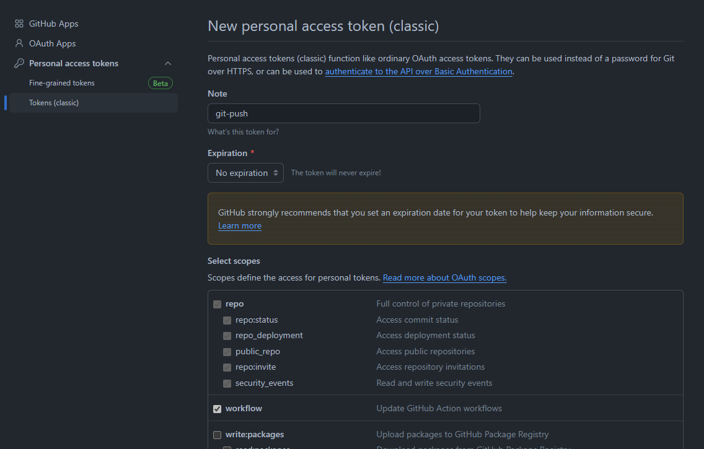
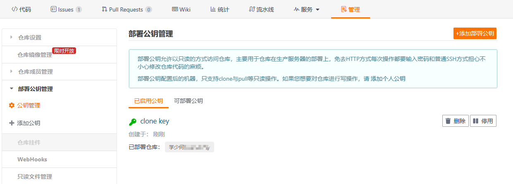
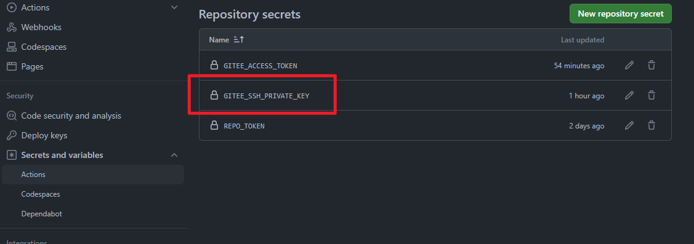
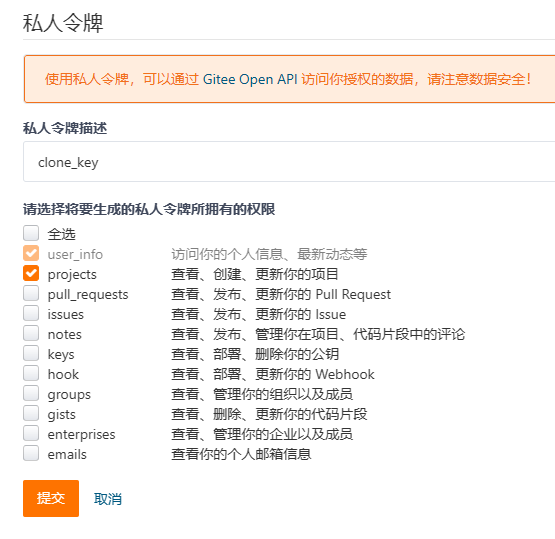

# 原因

开始尝试用 [vuepress](https://vuepress.vuejs.org/zh/) 编写文档，由于默认主题配置不是很方便，于是又尝试了 [vuepress-theme-hope](https://theme-hope.vuejs.press/zh/)，这个主题使用起来更舒服，配置更加方便快捷，顺带还提供了自动构建的 Github action。

于是就想着把私有仓库中构建好的页面，提交到公开仓库去，这样就可以使用 Github page 来部署了。

思路很简单，首先是将 Gitee 的仓库同步到 Github 中去，然后就可以尝试触发 [vuepress-theme-hope](https://theme-hope.vuejs.press/zh/) 的 Github action 来构建页面，构建好的页面存在另一个分支当中，把这个分支的提交同步给公开仓库就行了。

# 开始尝试同步

最简单的方式是先克隆 Gitee 的仓库，然后再提交到 Github。克隆 Gitee 仓库有两种方式，一种是通过 ssh，可以获取到提交记录；另一种是使用 Gitee 的 Open API，但这种方式不会有 Gitee 上的提交记录。

首先要有一个 Github Token。在 Github 的设置里找到 `Developer Settings`，选择 `Personal access tokens` -> `Tokens (classic)`，选择 `Generate new token (classic)`。`Expiration` 即有效期，根据自己的需求选择，我选择了无限期，然后下面的权限将 `repo` 和 `workflows` 全点上。



**Token 一定不要泄漏！**

## ssh 克隆仓库

首先需要生成一个 ssh 密钥。如何生成可以查看 Gitee 的文档[生成、添加 SSH 公钥](https://help.gitee.com/repository/ssh-key/generate-and-add-ssh-public-key)。使用的指令如下：

```bash
> ssh-keygen -t ed25519 -C "Gitee SSH Key"
```

生成的密钥可以通过打印到控制台的信息查看。找到保存密钥的位置（windows 在 `C:\Users\{user}\.ssh` 处，linux 位于 `~/.ssh` 文件夹下）。带有 `.pub` 后缀的为公钥，此处添加到了 Gitee 仓库的公钥中。设置为仓库的公钥可以保证这个公钥只用于克隆和同步仓库，可以增加安全性。



在 Github 创建一个和 Gitee 仓库同名的仓库，并将私钥配置给对应的 Github 仓库。找到仓库设置，找到 `Secrets and Variables`，点击 `New repository secret`，名字随意，然后将私钥的内容复制进去。



同理，之前生成的 Token 也要作为 secrets 配置进去。

这一步完成之后，我们就可以尝试使用 ssh 来克隆仓库了。

### 测试 ssh

按照 Gitee 的文档，接下来需要测试一下 ssh 连接是否能够联通。由于 Github action 的环境使用 linux 会更加简便，所以此处测试连接使用了 linux 环境。

在 `~/.ssh/id_ed25519` 中，将私钥复制进去。然后输入下面的命令测试连接：

```bash
> ssh -T git@gitee.com
```

回车执行之后，会有如下的提示内容：

```bash
@@@@@@@@@@@@@@@@@@@@@@@@@@@@@@@@@@@@@@@@@@@@@@@@@@@@@@@@@@@
@         WARNING: UNPROTECTED PRIVATE KEY FILE!          @
@@@@@@@@@@@@@@@@@@@@@@@@@@@@@@@@@@@@@@@@@@@@@@@@@@@@@@@@@@@
Permissions 0777 for '/home/xueshihao/.ssh/id_ed25519' are too open.
It is required that your private key files are NOT accessible by others.
This private key will be ignored.
Load key "/home/xueshihao/.ssh/id_ed25519": bad permissions
git@gitee.com: Permission denied (publickey).
```

linux 下，将私钥文件的文件属性设置为只读就行。使用下面的指令设置权限：

```bash
> chmod 700 ~/.ssh/id_ed25519
```

再次尝试测试连接，会提示下面的内容：

```bash
The authenticity of host 'gitee.com (180.76.198.77)' can't be established.
ECDSA key fingerprint is SHA256:FQGC9Kn/eye1W8icdBgrQp+KkGYoFgbVr17bmjey0Wc.
Are you sure you want to continue connecting (yes/no/[fingerprint])?
```

为了模拟 Github action 的方式，此处直接回车，然后会发现无法连接，提示如下：

```bash
Host key verification failed.
```

具体解决方案可以查看这篇博客：[SSH 连接时出现 Host key verification failed 的原因及解决方法](https://blog.csdn.net/xjp_xujiping/article/details/120012413)。需要修改的配置的条目，可以在 ssh 的文档中找到：[ssh_config - StrictHostKeyChecking](https://www.man7.org/linux/man-pages/man5/ssh_config.5.html)


打开或创建 `~/.ssh/config` 文件，将下面的内容添加到文件当中：

```config
Host gitee.com
StrictHostKeyChecking=no
```

配置完成后，再次输入 `ssh -T git@gitee.com` 并回车，就没有问题了。


### Github action 使用 ssh

完成了 ssh 的连接测试，接下来就可以先将上面的内容转存到 Github action 中了。在仓库的根目录创建 `.github` 文件夹，并在 `.github` 下创建 `workflows` 文件夹。创建一个文件末尾格式为 `.yml` 的文件，并在文件中输入下面的内容：

```yaml
name: Mirror sync
on:
  schedule:
    - cron: "0 0 * * *"
  workflow_dispatch:
env:
  REPO_NAME: repo-name
jobs:
```

`name` 是这个 action 的名字；`on` 表示在什么情况下触发这个 action，`schedule` 下设置了触发的时间，为每天的 0 点（北京时间 8 点），`workflow_dispatch` 则是可以手动运行 action。

`env` 中的键值对，代表运行时，控制台的环境变量，可以自由设置。但这个变量是公开可见的，所以不建议将 token 之类的东西写在这里。

关于 Github action 的其他内容可以查看[官方文档](https://docs.github.com/zh/actions)或者是使用到的 Github action 的示例。

由于 Github action 的用户目录没有 `.ssh` 文件夹，所以需要自己创建。然后将 ssh 的配置和私钥写入到对应的文件当中，注意私钥文件的文件权限，需要配置为只读。

```yaml
jobs:
  merge:
    runs-on: ubuntu-latest
    steps:
      - uses: actions/checkout@v4
      - name: Down load gitee source
        run: |
          mkdir ~/.ssh
          echo "Host gitee.com
          StrictHostKeyChecking=no" > ~/.ssh/config
          echo "${{ secrets.GITEE_SSH_PRIVATE_KEY }}" > ~/.ssh/id_ed25519
          chmod 700 ~/.ssh/id_ed25519
          eval $(ssh-agent)
          ssh -T git@gitee.com
          git clone git@gitee.com:your_name/${{ env.REPO_NAME }}.git
```

通过 `eval` 启用 ssh 认证，就可以克隆 Gitee 的私有仓库了。

### 提交到 Github

在上面的基础上，添加下面的指令：

```yaml
jobs:
  merge:
    runs-on: ubuntu-latest
    steps:
      - uses: actions/checkout@v4
      - name: Down load gitee source
        run: | # .....
          cd ${{ env.REPO_NAME }}
          git remote add github https://${{ secrets.REPO_TOKEN }}@github.com/studylessshape/game-story-private
          git push github master -f
```

这三个指令的作用分别是：

1. 进入到克隆的目录
2. 为当前的本地仓库添加远程 remote
3. 提交到 Github

将配置好的 action 文件提交到 Gitee 和 Github 的仓库上。然后修改一些其他文件的内容并提交到 Gitee 仓库上。

在 Github 的仓库页面，找到 Action，然后找到 Mirror sync。


点击旁边的 Run workflow，再点击绿色的 Run workflow。刷新一下就可以看见一个正在执行的工作流了。如果之前配置 Gitee 的 ssh 的公钥和私钥、以及 Github 的 Token 没有问题，那么运行结束后，所有的条目将都是正常完成的。


## 使用 Gitee Open API（不推荐）

完整的 Github aciton 直接放在下面了：

```yaml
name: Mirror sync
on:
  schedule:
    - cron: "0 0 * * *"
  workflow_dispatch:
env:
  GITHUB_REPO_NAME: <your-github-repo>
  GITEE_DIR_NAME: <your giteee repo>-<branch>
jobs:
  merge:
    runs-on: ubuntu-latest
    steps:
      - uses: actions/checkout@v4
      - name: Down load gitee source
        run: |
          wget https://gitee.com/api/v5/repos/<your_name>/<your-repo>/zipball?access_token=${{ secrets.GITEE_ACCESS_TOKEN }} -O <branch>.zip
          unzip <branch>.zip
          cp $GITEE_DIR_NAME/* . -r
          rm $GITEE_DIR_NAME <branch>.zip -rf
      - uses: EndBug/add-and-commit@v9 # You can change this to use a specific version.
        with:
          default_author: github_actor
          fetch: false
          committer_name: GitHub Actions
          committer_email: 41898282+github-actions[bot]@users.noreply.github.com
          pathspec_error_handling: ignore
```

要使用 Gitee Open API，需要先生成一个私人令牌。

### 生成私人令牌
在 Gitee 的个人设置里，找到**私人令牌**，点击**生成新令牌**，建议只勾选 `projects` 权限。



点击生成，将生成好的内容复制。打开对应的 Github 仓库，在 `Secrets and Variables` -> `Actions` 中，新建一个仓库机密，命名为 `GITEE_ACCESS_TOKEN`。这样，Github action 就能够使用这个私人令牌了。

### Action 中的命令解释
上面 Action 的命令逻辑很简单，首先是通过 Gitee Open API 将对应仓库的代码的 zip 下载下来，然后直接解压。关于 Gitee Open API 可以查看 Gitee 的 [Swagger 文档](https://gitee.com/api/v5/swagger#/)，只不过文档中并没有将所有的 API 列出来，比较可惜。

因为 `actions/checkout@v4` 以及将当前 Github 仓库的代码拉取下来，并将工作目录切换到了克隆的目录，所以直接将解压出来的所有的文件内容替换到当前文件夹下。同时记得需要删除解压出来的文件以及下载下来的安装包。

最后使用 `EndBug/add-and-commit@v9` 来执行提交操作。

# 后记
其实之前准备尝试使用 [hub-mirror-action](https://github.com/Yikun/hub-mirror-action) 来同步的，但是这个 action 只能支持一段的私钥和 Token 的配置，所以只能够同步公开仓库。

两种不同的方式的 action 都发布到这个仓库了：[sync-gitee-to-github](https://github.com/studylessshape/sync-gitee-to-github)