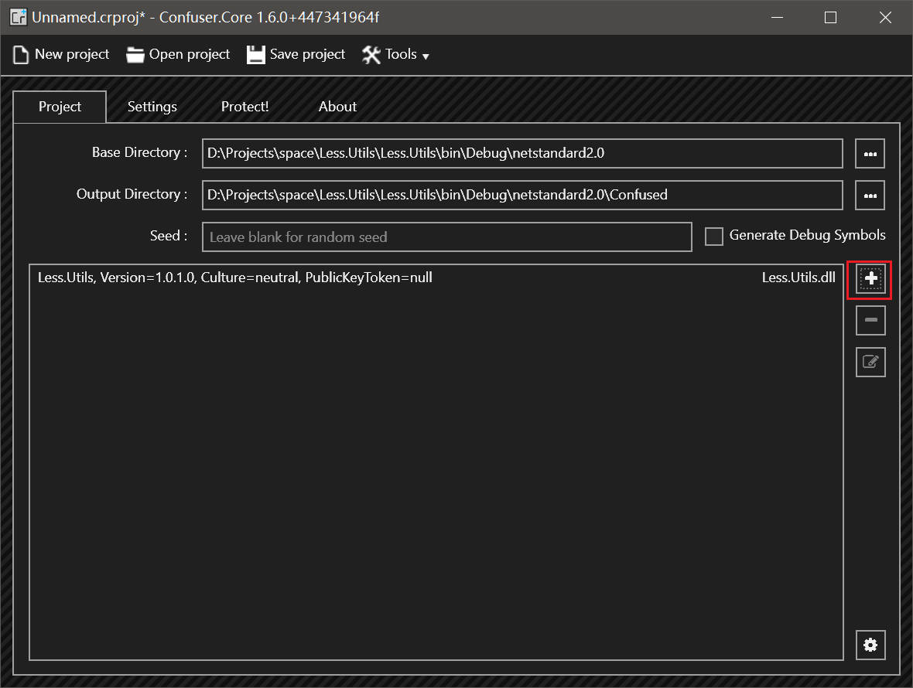

## 为什么需要对 C# 程序进行混淆和加密

通常需要这样做大多是因为商业项目。

就我个人情况而言，目前是在为一个公司使用的软件编写插件，有外发需求，所以需要对插件进行代码加密。

## 快速使用

目前我用得最舒适的方式是将 ConfuserEx 集成到项目中，并在编译的同时进行加密操作。

> ConfuserEx 的生成操作为，在项目构建完成之后，会将指定的文件进行加密，并根据配置来决定是否替换掉原文件。

### 使用前

ConfuserEx2 推荐去 Github 的 [Release 界面](https://github.com/mkaring/ConfuserEx/releases/latest)下载一个最新的 GUI 工具，方便管理和添加加密规则。

### 初始化加密

对于新建或者已有的 C# 项目，可以通过 Visual Studio 的包管理，或者通过 nuget 包管理器添加 ConfuserEx 的 MSBuild 包。

```bash
dotnet add package Confuser.MSBuild --version 1.6.0
```

然后打开 ConfuserEx 的 GUI 工具，点击加号添加一个需要加密的文件，可以是 DLL 也可以是 EXE。当然，这个文件最好是单独的一个项目生成的文件。

比如此处我的项目是 `Less.Utils`，所以我添加了 `Less.Utils.dll` 文件。



然后在 `Settings` 选项卡中，找到刚才添加的文件，然后点击右侧的加号添加一个加密规则。再点击编辑图标修改规则。

`Preset` 是预设，建议选择 `None`，如果是加密应用程序可以按照需要选择。

点击在 `Protection` 下方右侧的加号即可添加一个加密规则。加密规则可以有很多个可以选择。

目前 ConfuserEx 支持的规则有（描述都为机翻）：

- `Anti Debug`：此保护可防止对程序集进行调试或分析。
- `Anti Dump`：此保护可防止从内存中转储程序集。
- `Anti IL Dasm`：此保护使用阻止 ILDasm 反汇编的属性标记模块。
- `Anti Tamper`：此保护可确保应用程序的完整性。
- `Constants`：此保护对代码中的常量进行编码和压缩。
- `Control Flow`：此保护会破坏方法中的代码，以便反编译器无法反编译方法。
- `Protection Hardening`：此组件改进了保护代码，使其更难绕过它。
- `Invalid Metadata`：此保护将无效的元数据添加到模块中，以防止反汇编器/反编译器打开它们。
- `Resources`：此保护对嵌入的资源进行编码和压缩。
- `Type Scrambler`：将类型替换为泛型。
- `Name`：此保护会混淆符号的名称，因此既不能编译也不能读取反编译的源代码。
- `Watermarking`：这会将水印应用于程序集，表明 ConfuserEx 保护了程序集。所以人们试图扭转混淆，知道放弃。

对于类库的加密，目前个人添加的是 `Anti Dump`、`Anti IL Dasm`、`Anti Tamper`、`Constants`、`Control Flow` 这 5 项。

添加完成后，点击工具栏的 `Save Project`，保存到项目的根目录下，文件命名和项目名需要一致。

### 项目设置

加密会影响调试，所以首选需要设置在 Release 模式下才进行加密。

双击项目打开项目文件，在文件中添加下面的内容：

```xml
<PropertyGroup Condition="'$(Configuration)' == 'Release'">
  <Obfuscate>true</Obfuscate>
  <ConfuserReplaceOutput>true</ConfuserReplaceOutput>
</PropertyGroup>
```

这几行配置了在 Release 模式下启用加密，并替换掉原来的文件。

然后打开刚才保存的加密配置文件，文件名为 `<项目名>.crproj`。如果在 VS 中不存在，可以通过右键项目，添加现有项来添加。

打开之后，将路径替换为 `$(Output)`，修改后保存。

```xml
<project outputDir="$(Output)\Confused" baseDir="$(Output)" xmlns="http://confuser.codeplex.com">
  <module path="Less.Utils.dll">
    <rule pattern="true" inherit="false">
      <protection id="anti dump" />
      <protection id="anti ildasm" />
      <protection id="anti tamper" />
      <protection id="constants" />
      <protection id="ctrl flow" />
    </rule>
  </module>
</project>
```

这样，加密配置就完成了。现在在 Release 模式下编译的生成的文件，就会应用上面的加密规则。

## 市面上的加密工具

### Dotfuscator

可以直接使用 Visual Studio Installer，在其单个组件中找到并安装。安装之后在 Visual Studio 中使用功能搜索 dot，就能够使用了。相对来说使用方便，但是免费版加密程度有限，而且在我实际使用时，加密后的插件无法正常使用，所以不太推荐。

不过如果是加密应用程序，应该还是没有问题的。

### Agile.NET

[Agile.NET](https://www.secureteam.net/acode-features-detailed) 是一个商业的加密工具，功能强大，但是需要付费，而且价格不便宜。

不过效果确实看着不错，加密后的代码公开方法和类型都能够正常用 ILSpy 和 dnSpy 查看，只是方法体全被去掉了。

### 结界.NET

[结界.NET](https://github.com/dcsoft-yyf/JIEJIE.NET) 是开源的命令行加密工具，同时也有 GUI 界面。使用方法可以看一下这个博客 -> [【JIEJIE.NET - 强大的 .NET 代码混淆工具】](https://www.cnblogs.com/dotnet-box/p/17360983.html)

不过这个加密工具同样是不推荐对类库进行加密，个人只推荐加密应用程序。

### ConfuserEX2

[ConfuserEx2](https://github.com/mkaring/ConfuserEx)，也是原作者停止更新后，社区其他开发者接手更新的项目。目前没有继续发布新的稳定版本了，但是还在继续更新。

这个工具除了 GUI 的界面，还有对应的 nuget 包 [Confuser.MSBuild](https://www.nuget.org/packages/Confuser.MSBuild)，能够在项目编译的同时进行加密操作。

就个人目前使用体验而言，这个是用起来最无感且最方便的。

## 一些反编译工具

- [ILSpy](https://github.com/icsharpcode/ILSpy)
- [dnSpy(Ex)](https://github.com/dnSpyEx/dnSpy) _这个是原作者停止维护后，其他开发者接手并持续更新的项目_

dnSpy 可以修改并重新编译程序和 DLL 文件，相对来说功能更强大。